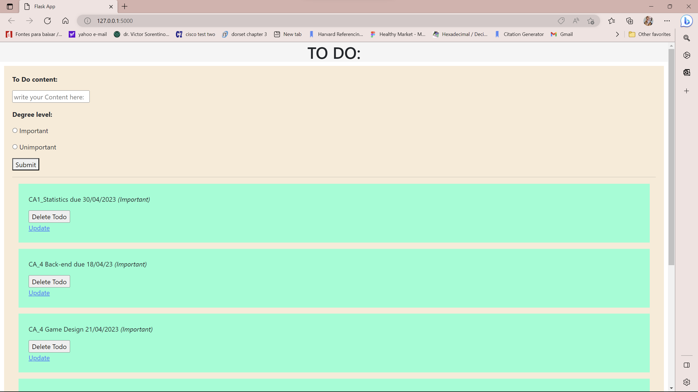
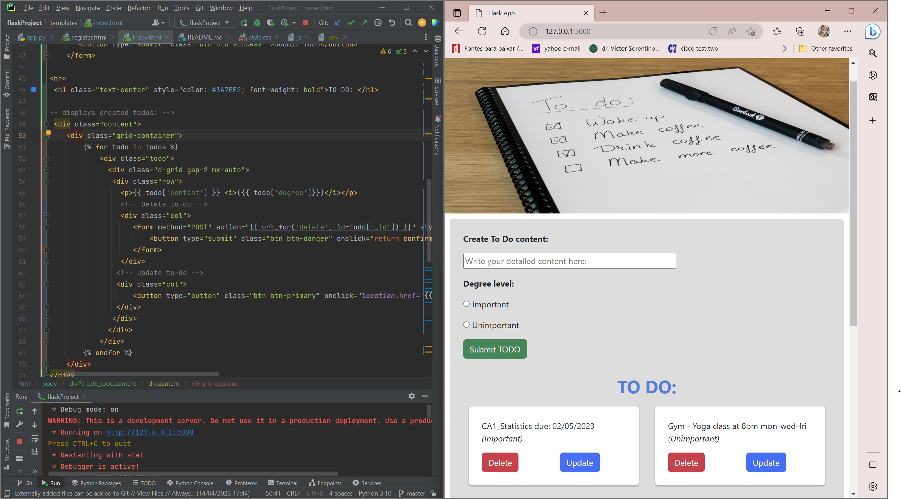
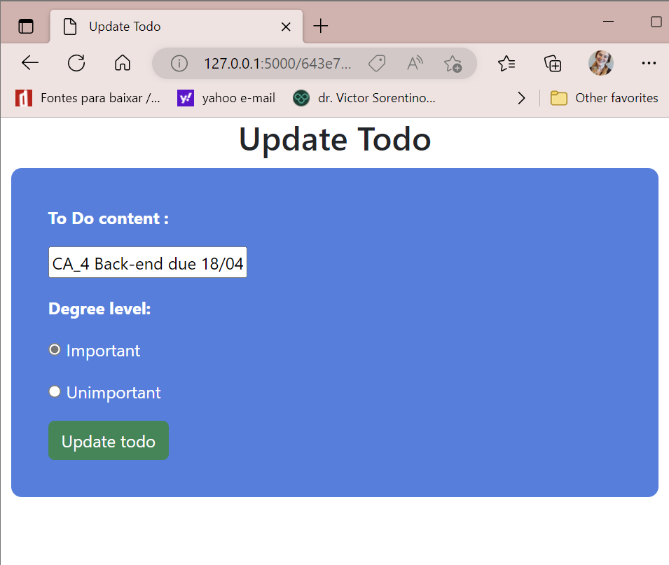

# CA4 - Python, MongoDB, Flask Project
## Back-end Web Development - BSC 30922
### Student: Graciele Maria Ludwig
### Student number: 22711

## Report:
   This project requires the development of a to-do application using Flask, MongoDB, and Python.
The application is intended to facilitate the management of tasks by enabling users to create, read, update, and delete items on their to-do lists.
CRUD is an acronym that stands for Create, Read, Update, and Delete.
Create: This operation involves adding new data to the database. 
In a Flask-MongoDB-Python application, this might involve creating a new document and inserting it into a MongoDB collection.
Read: This operation involves retrieving data from the database.
This might involve querying the database to retrieve a specific document or a set of documents that meet certain criteria.
Update: This operation involves modifying existing data in the database.
Involves updating the fields of a document in a MongoDB collection.
Delete: This operation involves removing data from the database.
 By implementing CRUD (create + read + Update + delete) developers can create applications that are capable of handling user data in a dynamic and efficient way.

   Flask is another framework option to work with Python, it is a micro web framework that provides a lightweight WSGI framework for developing web applications. WSGI - Web Server Gateway Interface is a simple calling convention for
web servers to forward requests to web apps or frameworks written in the Python programming language.
It is widely used in the development of web applications due to its simplicity, ease of use, integrated support for unit testing, RESTful request dispatching and support for secure cookies.

   MongoDB is a NoSQL database that is designed for scalability, flexibility, and performance. It is particularly well-suited for applications that require dynamic data modeling and real-time data processing.
MongoDB uses JSON-like documents with optional  schemas, data in the form of Objects, easily scalable
   Python is a high-level programming language that is widely used in web development due to its ease of use, increase productivity, interpreted, free and open-source, abundant libraries  and versatility.
It is well-suited for developing web applications that require complex data structures and processing.
The application is expected to allow users to create new to-do items, read and display existing items, update existing items as required, and delete items that are no longer relevant.
The application is also expected to provide a user-friendly interface that is easy to navigate and intuitive to use.
By leveraging these technologies, developers can create powerful and scalable applications that are capable of handling complex data structures and processing requirements.
   
   An organized collection of data (database) is typically required for online applications.
To preserve persistent data that can be efficiently retrieved and changed, you utilize a database. 
In a database, you can add data, retrieve it, edit it, or delete it, depending on various conditions and requirements.
These conditions might be met by a user creating a new post, deleting an existing post, or deactivating their account, 
which may or may not also erase their posts, in a web application. Your application's individual features will determine the steps you take to alter data.
    
Our first task was create a working environment with Python, Flask and Mongo DB as you can see in the following screenshot:

 

This was the application design in the beginning after following a tutorial to create a todo app that stores data in a cloud database : https://cloud.mongodb.com/ 

CRUD refers to the basic operations that can be performed on the data stored in a MongoDB database, 
in this project was used mongoDB atlas, and all crud operations are working accordingly:

After a few changes on the index file and CSS in the attempt to make it look a bit more professional:

Following a screenshot of the cards of todos with tag to say if is important or unimportant and delete option working:

This is the update page working as desired:

### References:

www.digitalocean.com. (n.d.). How To Install MongoDB on Ubuntu 20.04 | DigitalOcean. [online] Available at: https://www.digitalocean.com/community/tutorials/how-to-install-mongodb-on-ubuntu-20-04#step-1-installing-mongodb [Accessed 05 Apr. 2023].

‌

www.youtube.com. (n.d.). Flask Training | How to Create Simple Login Form in Python Flask & MongoDB | Intellipaat. [online] Available at: https://www.youtube.com/watch?v=wRYKa7Pzem4 [Accessed 11 Apr. 2023].

‌

Unsplash (n.d.). Photo by Thomas Bormans on Unsplash. [online] unsplash.com. Available at: https://unsplash.com/photos/pcpsVsyFp_s [Accessed 15 Apr. 2023].

‌